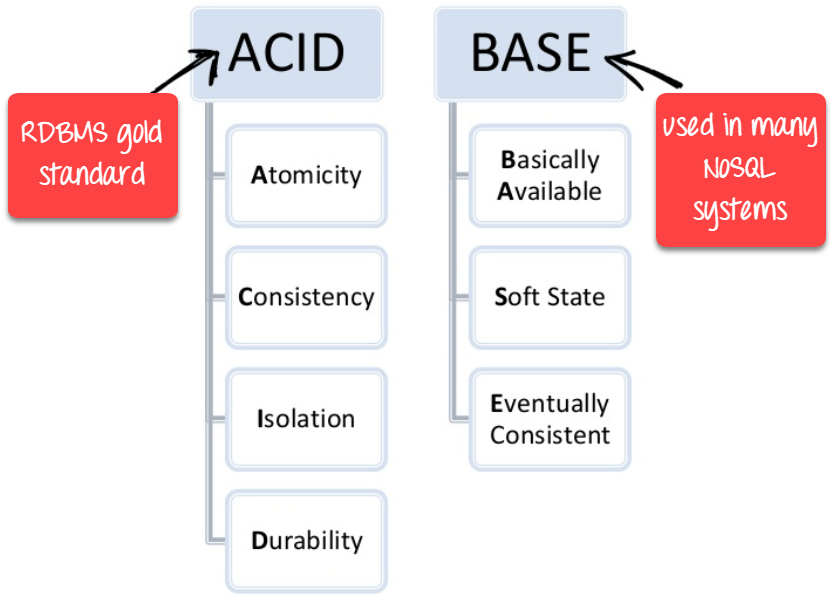
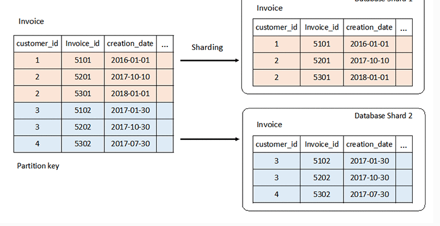
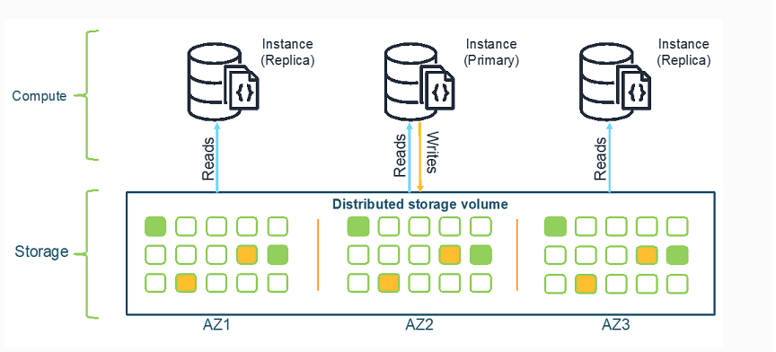

**09-06-25**
# 🧩 Principais Diferenças: Banco de Dados Relacional vs Não Relacional

Fonte: [AWS - Diferenças entre bancos de dados relacionais e não relacionais](https://aws.amazon.com/pt/compare/the-difference-between-relational-and-non-relational-databases/)

---

## 🧱 Estruturas

- **🗃️ Bancos de dados relacionais** utilizam um modelo tabular com esquemas rígidos e bem definidos. Permitem a execução de consultas complexas, preservando a integridade e a consistência dos dados.

- **📦 Bancos de dados não relacionais** oferecem maior flexibilidade. Adaptam-se melhor a estruturas variáveis e suportam dados semiestruturados ou não estruturados, como JSON, XML ou objetos binários.

---

## 🛡️ Mecanismos de Integridade de Dados

- **🔒 Relacionais (SQL)** seguem o modelo **ACID** — Atomicidade, Consistência, Isolamento e Durabilidade. Ele garante que as transações sejam confiáveis, mesmo em casos de falha.

  

- **⚡ Não relacionais (NoSQL)** geralmente adotam o modelo **BASE** — Basicamente Disponível, Estado Soft e Eventualmente Consistente. Este prioriza a **disponibilidade** e a **escalabilidade**, especialmente em ambientes distribuídos.

  

---

## 🚀 Performance

- **💾 Relacionais** têm performance influenciada por fatores como disco, CPU, memória e índices. Otimizações geralmente requerem **upgrades de hardware** ou ajustes finos na estrutura de dados e nas consultas.

- **🌐 Não relacionais** são concebidos para operar em **clusters distribuídos**, com performance escalável de forma linear à medida que novos nós são adicionados.

---

## 📈 Escalabilidade

- **🧰 Relacionais** escalam verticalmente (scale-up): adiciona-se mais poder ao servidor (CPU, memória, disco). Estratégias como **réplicas de leitura** e **sharding** podem auxiliar na distribuição de carga, mas envolvem maior complexidade.

  

- **🧮 Não relacionais** escalam horizontalmente (scale-out): novos servidores são adicionados de forma mais simples, ideal para sistemas com grandes volumes de dados ou picos imprevisíveis de tráfego.

  

---

## 🧠 Quando Usar?

### ✅ Use bancos relacionais quando:
- Os dados são **estruturados e estáveis**;
- A **consistência** é mais importante que a disponibilidade;
- Há **relacionamentos complexos** entre os dados;
- É necessário **controle transacional rigoroso**.

### 📌 Use bancos não relacionais quando:
- Os dados são **flexíveis, variáveis ou não estruturados**;
- A **disponibilidade e escalabilidade horizontal** são prioridades;
- A estrutura de dados muda com frequência;
- A aplicação exige **respostas rápidas e tolerância a falhas**.

---

## 🧾 Resumo das Diferenças: Relacional vs Não Relacional

| 🏷️ Categoria               | 🗃️ Banco de dados relacional                                    | 📦 Banco de dados não relacional                             |
|---------------------------|------------------------------------------------------------------|--------------------------------------------------------------|
| **Modelo de dados**       | Tabular, com esquemas rígidos.                                  | Chave-valor, documento, grafo, ou colunar.                  |
| **Tipo de dados**         | Estruturado.                                                    | Estruturados, semiestruturados e não estruturados.          |
| **Integridade dos dados** | Alta, com conformidade ao modelo ACID.                          | BASE: Consistência eventual com alta disponibilidade.        |
| **Performance**           | Otimizada por upgrades de hardware e tuning de consultas.       | Otimizada com adição de nós ao cluster distribuído.         |
| **Escalabilidade**        | Vertical, com suporte a réplicas e *sharding*.                  | Horizontal, simples e altamente escalável.                  |

---
