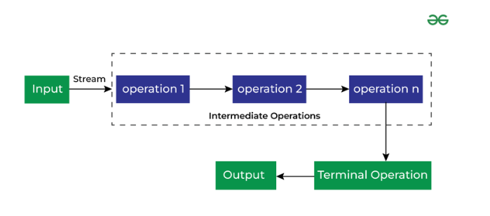
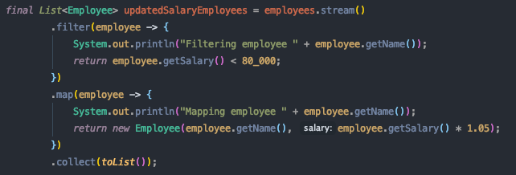
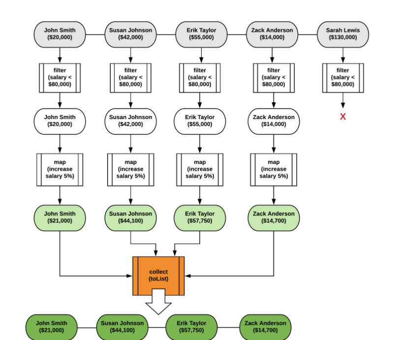
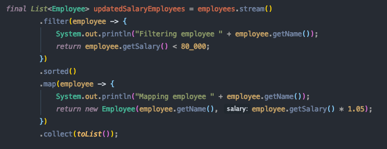
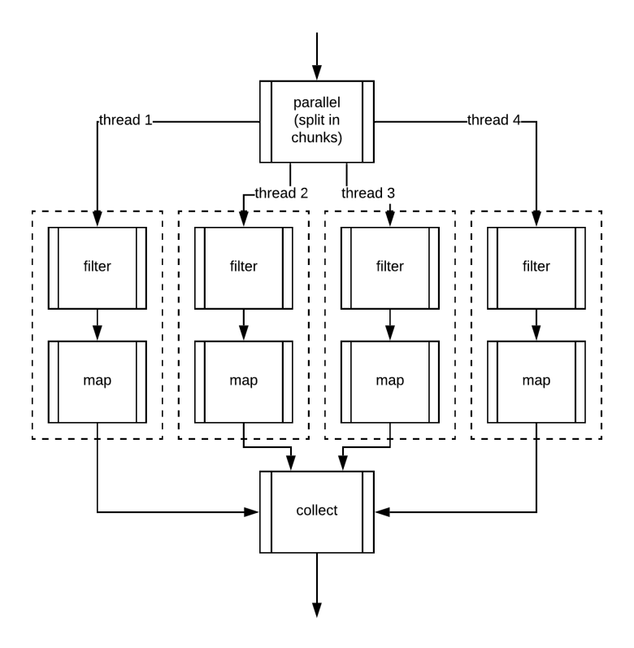
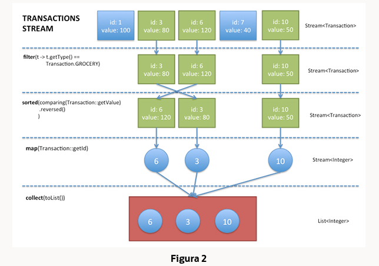

# 📚 **Bibliotecas de Stream do Java**

## ☕ Oracle Docs

### 🔍 O que é o Stream do Java?

Um *Stream* é uma sequência de elementos que suporta operações de agregação sequenciais e paralelas.

```java
int sum = widgets.stream()
                 .filter(w -> w.getColor() == RED)
                 .mapToInt(w -> w.getWeight())
                 .sum();
```

Para realizar uma computação, as operações de fluxo são compostas em um *pipeline*, que inclui:

* **Fonte**: array, coleção, função geradora, canal de E/S etc.
* **Operações intermediárias**: transformam um fluxo em outro, como `filter(Predicate)`
* **Operação terminal**: produz um resultado ou efeito colateral, como `count()` ou `forEach(Consumer)`

⚠️ *Streams são preguiçosos*: só executam quando a operação terminal é chamada.

📌 As coleções acessam elementos diretamente. Os streams **descrevem declarativamente** como processar dados.

---

## 🌐 Geeks for Geeks

📅 Introduzidos no **Java 8**.

### 🛠️ Recursos principais

* 🚫 Não é estrutura de dados
* ♻️ Não altera a estrutura original
* 💤 Lazy (preguiçoso)
* 🔁 Retorna novos streams após cada operação intermediária

### 🧩 Tipos de operações

1. 🔄 **Intermediárias**
2. 🧱 **Terminais**



### ✅ Benefícios

* 📦 Sem armazenamento adicional
* 🔗 Criação de pipelines
* 💤 Execução preguiçosa
* ♾️ Pode ser infinito
* ⚡ Pode ser paralelizado

---

## 🎯 The Bored Dev

Streams são pipelines de operações agregadas sobre sequências de elementos.

* 💤 Preguiçosos
* 🕳️ Consumíveis uma única vez
* 🧵 Sequenciais por padrão, mas suportam paralelismo

---

## ⚙️ Execução do Stream

### 🧪 Execução sem estado

✅ Mais simples de paralelizar e eficiente.



```bash
Filtering employee John Smith
Mapping employee John Smith
Filtering employee Susan Johnson
...
```



🧠 **Importante**: Os elementos são processados **um a um**. Primeiro filtra, depois aplica `map`, e assim por diante — e não em blocos.

---

### 🧠 Execução com estado

Adicionando operações com estado (como `sorted()`), o comportamento muda:



```bash
Filtering employee John Smith
Filtering employee Susan Johnson
...
Mapping employee Erik Taylor
```

🔀 O pipeline é **dividido em duas partes**.

🧊 `sorted()` armazena os elementos em buffer antes de emitir para o próximo estágio.

---

### 🧵 Execução paralela

💡 Múltiplas threads processam diferentes partes dos dados em paralelo.



🔄 No final, os resultados são **mesclados** em um único resultado final.

---

## 📘 Oracle - ma14-java-se-8-streams

### ✨ Abstração declarativa

> *“Uma sequência de elementos de uma fonte que suporta operações de agregação.”*

📌 *Sem armazenar elementos — apenas computados sob demanda*.

### 🔧 Componentes

* 🧪 Sequência de elementos
* 📤 Fonte (coleção, array, I/O)
* 🔍 Operações como `filter`, `map`, `reduce`, `sorted`
* 🔗 Pipelining (encadeamento)
* 🔁 Iteração interna (transparente para o desenvolvedor)



---

### 📦 Coleções vs Streams

* 🧺 **Coleções** → armazenam dados
* ⚙️ **Streams** → processam dados sob demanda

> Coleções usam **iteração externa**, Streams usam **iteração interna**.

---

### 🔄 Operações de fluxo

* ⚙️ Intermediárias: `map`, `filter`, `sorted`
* ⛔ Terminais: `collect`, `forEach`, `reduce`

💡 *Intermediárias são preguiçosas e só executam quando uma terminal for chamada.*

**Exemplo:**

```java
List<Integer> numbers = Arrays.asList(1, 2, 3, 4);
List<Integer> twoEvenSquares =
    numbers.stream()
           .filter(n -> {
               System.out.println("filtering " + n);
               return n % 2 == 0;
           })
           .map(n -> {
               System.out.println("mapping " + n);
               return n * n;
           })
           .limit(2)
           .collect(toList());
```

📥 Saída:

```bash
filtering 1
filtering 2
mapping 2
filtering 3
filtering 4
mapping 4
```

> `limit(2)` **interrompe** o stream assim que obtém 2 elementos válidos.

---

### 🔢 Streams Numéricos

Utilize `mapToInt`, `mapToDouble`, `mapToLong` para gerar versões primitivas dos streams:

```java
int statementSum =
    transactions.stream()
                .mapToInt(Transaction::getValue)
                .sum();
```

---

## 🧾 Conclusão

Com a API de Streams do Java SE 8, é possível escrever **consultas poderosas, legíveis e eficientes**.

✅ Vantagens:

* Lazy evaluation
* Curto-circuito
* Paralelismo transparente
* Código mais limpo e funcional

> *Streams transformam a forma como lidamos com coleções e processamento de dados.*

---

## 🔗 Links úteis

* [📄 Oracle Docs](https://docs.oracle.com/javase/8/docs/api/java/util/stream/Stream.html)
* [🧠 GeeksForGeeks](https://www.geeksforgeeks.org/stream-in-java/)
* [🧵 The Bored Dev](https://theboreddev.com/understanding-java-streams/)
* [📘 Livro Java 8 in Action](https://www.amazon.com/Java-Action-Lambdas-functional-style-programming)
* [☕ Oracle Article](https://www.oracle.com/technical-resources/articles/java/ma14-java-se-8-streams.html)
